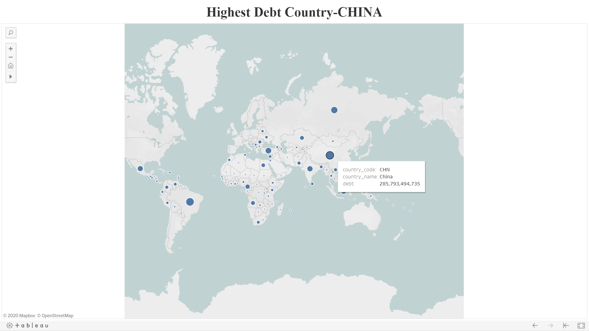
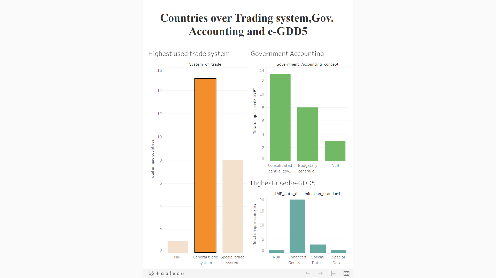
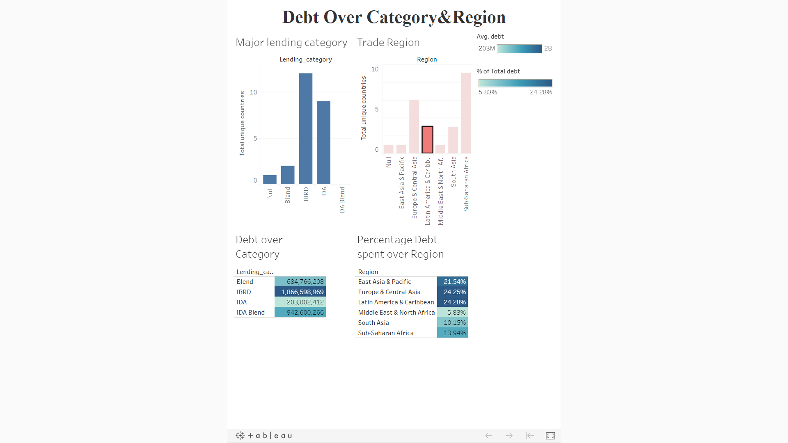
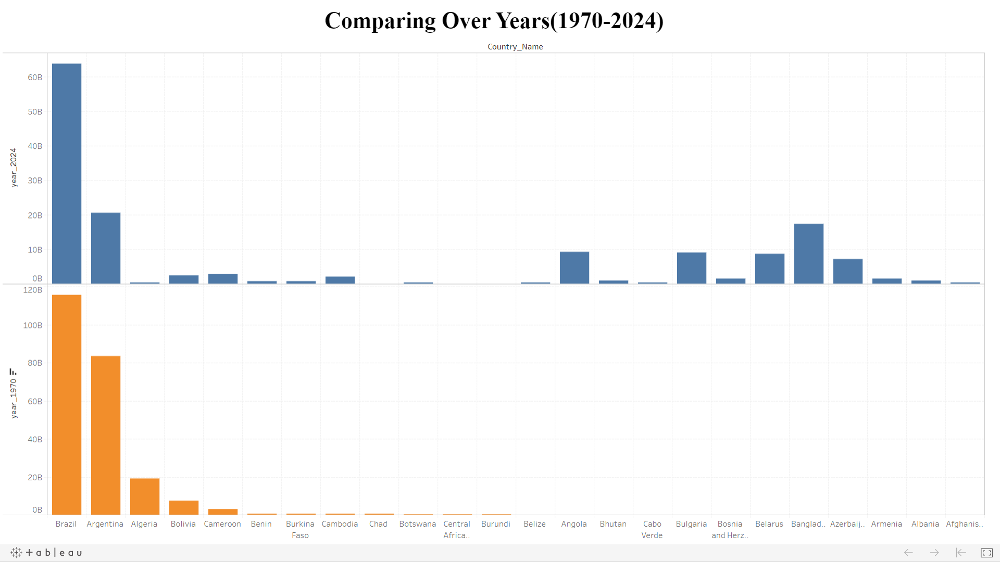

# Analyzing-International-Debt-Statistics

Analyzing the debt taken by different countries from the World Bank.
Here Data is collected and imported from Kaggle.
There are three datasets that is international_debt table, IDSData, IDSCountry where Data Cleaning and Manipulation is performed using Python Library such as NumPy and 
Pandas and js implemented using MySQL and Python JuypterNotebook, and  
further Tableau is used to do the analysis of the data, which  
resulted into  some great  insights that can help to  take future decisions.

